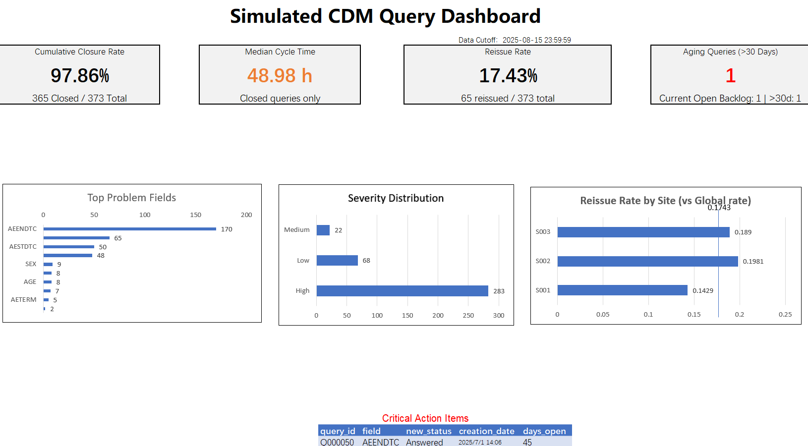

# 基于模拟数据的 CDM 报表练习项目

## 项目简介

这是一个基于**纯模拟数据**完成的 CDM（Clinical Data Management，临床数据管理）相关练习项目。  
项目重点不在于模拟完整的真实 CDM 工作流，而在于：在缺乏真实 EDC 系统环境的前提下，对模拟的 query / discrepancy 相关数据进行整理、汇总，并输出一份用于观察处理情况的简单报表。

## 项目输出预览

---

## 项目背景

在真实临床数据管理工作中，大量数据录入、质疑（query）发起与关闭、数据核查、审计追踪等流程通常依赖 EDC 系统完成。  
但由于个人练习环境无法获取真实企业级 EDC 系统，也无法完整复现真实 study build、Edit Check 配置、角色权限流转、Audit Trail 等核心环节，因此本项目只聚焦于个人能够独立完成的部分：

* 1.使用模拟数据组织 query / discrepancy 相关表格
* 2.对部分常见运营指标进行统计
* 3.输出最终静态报表，用于展示 aging、cycle time 等结果

---

## 项目定位

本项目的定位是：

**基于模拟数据的 CDM 后续数据整理与报表输出练习**

故不应将本项目理解为：

* 真实临床试验数据管理项目
* 完整 EDC 系统操作演示
* 真实生产环境下的数据库构建或锁库项目

---

## 我在这个项目中实际完成的内容

本项目中，我实际完成的工作主要包括：

1. **整理模拟数据文件**

   * 对原始模拟数据进行拆分、汇总与关联
   * 形成 query 日志、事件日志、站点维度汇总等中间结果

2. **使用 Python 辅助处理数据**

   * 使用 Python 主要是pandas库对部分数据进行清洗、统计和结果输出
   * 主要用于生成 aging、cycle time、site summary 等报表内容

3. **制作最终静态报表**

   * 将整理后的结果整合到 Excel 文件中
   * 以仪表盘/汇总表形式展示核心指标

4. **梳理自己对 CDM 岗位部分工作的理解**

   * 重点放在 query 处理结果的汇总观察
   * 认识到没有真实 EDC 环境时，个人练习更适合聚焦于报表和后续数据整理，而不是强行模拟完整系统流程

---

## 项目文件说明

当前项目主要包含以下内容（以仓库实际文件为准）：

* `raw.csv`：模拟原始数据
* `discrepancy.csv`：模拟 discrepancy 相关数据
* `query\_log.csv`：query 汇总日志
* `query\_event\_log.csv`：query 事件日志
* `aging.csv`：aging 统计结果
* `cycle_time.csv`：cycle_time 统计结果
* `sited_log.csv` / 其他 site 相关文件：站点维度统计过程文件
* `aging.py`：aging 相关处理脚本
* `cycle_time.py`：cycle_time 相关处理脚本
* `sited_log.py` / `sited_summary.py`：site 维度汇总脚本
* `dashboard.xlsx`：报表结果

说明：  
项目中部分文件既承担**中间处理痕迹**，也承担**结果整理功能**。这些工作痕迹主要用于我个人复查与核对，不等同于真实 EDC 系统中的审计追踪。

---

## 核心输出结果

本项目的最终输出结果主要体现在 `dashboard.xlsx` 中的静态报表页面。  
该报表用于对模拟 query/discrepancy 数据的处理状态进行汇总展示，重点呈现 query 关闭情况、处理效率、重发情况、长期未关闭问题以及字段/站点层面的分布特征。

最终报表当前包含以下核心内容：

### 1\. 核心 KPI 卡片

* **Cumulative Closure Rate**  
  展示截至数据截点已关闭 query 在全部 query 中的占比。  
  当前报表结果为 **97.86%**（365 Closed / 373 Total）。
* **Median Cycle Time**  
  展示已关闭 query 从创建到关闭的中位处理时长。  
  当前报表结果为 **48.98 h**。  
  该指标仅统计 **closed queries**。
* **Reissue Rate**  
  展示被重新发出的 query 在全部 query 中的占比。  
  当前报表结果为 **17.43%**（65 Reissued / 373 Total）。
* **Aging Queries (>30 Days)**  
  展示截至数据截点仍处于打开状态且已超过 30 天未关闭的 query 数量。  
  当前报表结果为 **1**。  
  同时报表中同步展示当前 open backlog 数量。

### 2\. 字段与严重程度分布

* **Top Problem Fields**  
  展示问题最集中的字段，用于观察 query/discrepancy 主要集中在哪些数据字段。
* **Severity Distribution**  
  展示不同严重程度下的问题分布情况，用于观察当前问题结构中高、中、低等级问题的占比。
  但是Severity Distribution 是基于模拟数据中预设的严重程度分类字段统计，仅用于展示问题结构分布。

### 3\. 站点维度对比

* **Reissue Rate by Site (vs Global rate)**  
  展示各站点 reissue rate 与整体 global reissue rate 的对比，用于识别重发比例偏高的站点。

### 4\. 待重点处理条目

* **Critical Action Items**  
  展示当前需要重点关注的长期未关闭问题，用于快速定位 backlog 中最需要优先处理的条目。

### 5\. 数据截点说明

当前 dashboard 基于设定的数据截点统计生成。  
截图中的数据截点为：

* **Data Cutoff: 2025-08-15 23:59:59**

本项目的最终输出重点是：  
基于模拟数据，对 query 处理情况进行可视化汇总展示，而不是模拟完整真实 CDM 系统工作流。

## 我对这个项目边界的理解

这个项目有明确边界。

我认为它可以主要展示以下能力：

* 对模拟 CDM 相关数据进行整理和汇总
* 对 query/backlog/aging/cycle time 等结果进行统计
* 将结果转化为相对清晰的静态报表输出
* 对岗位中“后续数据整理和结果呈现”这一部分形成初步理解

但它**不能证明**我具备以下真实生产能力：

* 真实 EDC 系统使用经验
* 数据库建库与表单配置经验
* Edit Check 编写与部署经验
* 真实 Query Workflow 管理经验
* 完整的临床试验数据库清理与锁库经验

因此，这个项目更适合被看作一份**面向实习阶段的模拟练习作品**，而不是成熟的正式岗位实战项目。

---

## 关于代码说明

本项目中使用了 Python 脚本进行部分数据处理。  
代码的主要作用是帮助完成数据整理、统计计算和报表输出，并不是构建一个完整的软件工程项目。

因此，本项目的重点不在于复杂程序设计，而在于：

* 数据整理思路
* 指标汇总过程
* 最终报表结果的表达

当前脚本主要服务于本项目的数据处理流程。若后续仓库结构调整，可能需要同步修改输入输出路径后再运行。

代码的写作使用了AI进行辅助。

---

## 使用说明

1. 准备项目中的模拟数据文件
2. 根据当前目录结构调整 Python 脚本中的输入输出路径
3. 运行对应脚本，生成中间统计结果
4. 在最终 Excel 报表文件中查看汇总输出

说明：  
由于本项目以个人练习为主，当前更侧重结果展示，不保证具备严格的工程化复现能力。

---

## 局限性说明

本项目存在以下局限：

* 数据全部为模拟数据，不来自真实临床研究
* 缺乏真实 EDC 系统环境，无法覆盖真实 CDM 工作中的系统配置、权限、审计追踪等关键环节
* 部分规则与字段组织方式服务于练习目的，不代表真实企业 SOP
* 项目输出以静态报表为主，不能等同于完整 CDM 交付成果

---

## 适用场景

我认为这份项目更适合用于：

* 个人学习记录
* 面向实习阶段的练习作品展示
* 展示自己对 CDM 下游报表整理工作的初步理解

不适合用于宣称自己具备完整真实 CDM 项目经验。

---

## 后续优化方向

后续可能继续优化的方向包括：

* 进一步规范文件命名和目录结构
* 补充更清晰的指标定义页
* 提高脚本路径管理的一致性
* 优化报表的版式和可读性

---

## 备注

本项目仅用于学习和能力练习展示。  
若未来获得真实 EDC 系统训练机会，项目理解与输出方式还需要进一步修正和升级。

